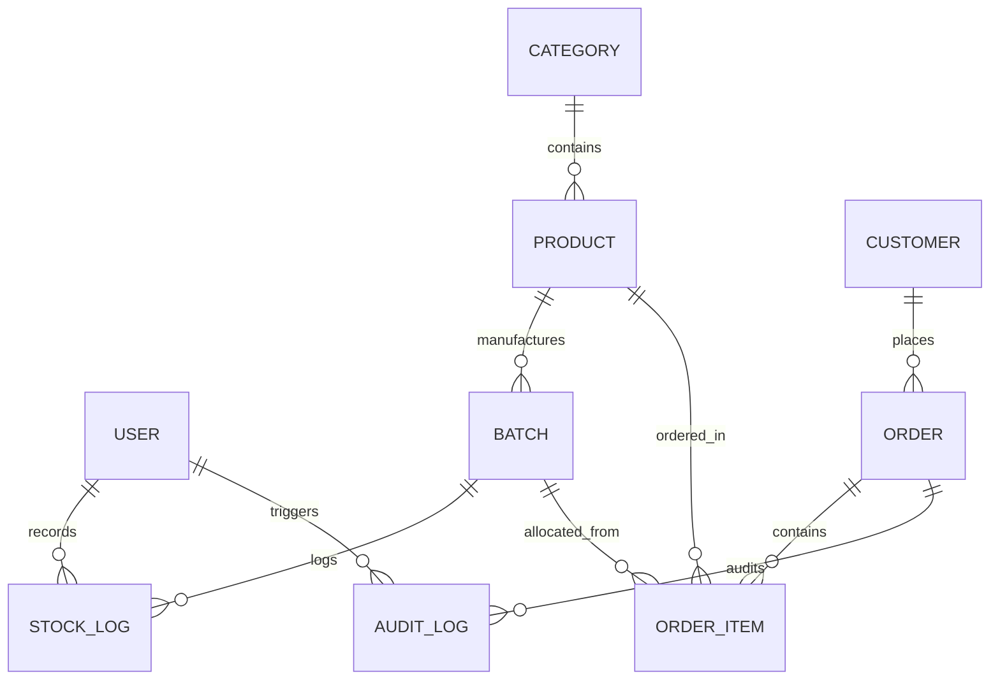

# Database Schema & ER Diagram Specification

This document details the relational schema, constraints, data types, and index optimizations implemented via Prisma ORM for Sharadha Stores.

---

## 1. Entity-Relationship (ER) Diagram

---

## 2. Table Specifications

### User
Tracks authentication details and role memberships.
* **id**: `String` (UUID, Primary Key)
* **email**: `String` (Unique, Index)
* **passwordHash**: `String`
* **name**: `String`
* **role**: `Enum` (`SUPER_ADMIN`, `ADMIN`, `INVENTORY_MANAGER`, `PRODUCTION_MANAGER`, `DISPATCH_TEAM`, `CUSTOMER_SUPPORT`)
* **createdAt** / **updatedAt**: `DateTime`

### Category
Groups products for cataloging.
* **id**: `String` (UUID, Primary Key)
* **name**: `String` (Unique)
* **description**: `String?`
* **createdAt** / **updatedAt**: `DateTime`

### Product
Defines inventory items and baseline parameters.
* **id**: `String` (UUID, Primary Key)
* **name**: `String`
* **sku**: `String` (Unique, Index)
* **description**: `String?`
* **price**: `Decimal`
* **shelfLifeDays**: `Int` (Days before product expires)
* **thresholdStock**: `Int` (Lower stock bound for low-stock triggers)
* **imageUrl**: `String?`
* **categoryId**: `String` (Foreign Key to Category)
* **createdAt** / **updatedAt**: `DateTime`

### Batch
Tracks specific production items and their physical shelf life.
* **id**: `String` (Primary Key, custom string: `SKU-YYYYMMDD-seq`)
* **productId**: `String` (Foreign Key to Product)
* **mfgDate**: `DateTime` (Date manufactured)
* **expiryDate**: `DateTime` (Calculated: `mfgDate` + Product `shelfLifeDays`, Index)
* **quantityProduced**: `Int`
* **packagingCount**: `Int` (Number of packed boxes/packets)
* **currentStock**: `Int` (Remaining available stock, FEFO-deducted, Index)
* **status**: `Enum` (`ACTIVE`, `EXPIRED`, `EXHAUSTED`, `RECALLED`)
* **createdAt** / **updatedAt**: `DateTime`

### Customer
Customer profile management for CRM.
* **id**: `String` (UUID, Primary Key)
* **name**: `String`
* **phone**: `String` (Unique, Index)
* **email**: `String?`
* **address**: `String?`
* **createdAt** / **updatedAt**: `DateTime`

### Order
Orders placed and their full lifecycle statuses.
* **id**: `String` (UUID, Primary Key)
* **orderNumber**: `String` (Unique, Index, Format: `SS-YYYYMMDD-seq`)
* **customerId**: `String` (Foreign Key to Customer)
* **status**: `Enum` (`PENDING`, `CONFIRMED`, `PROCESSING`, `PACKED`, `DISPATCHED`, `DELIVERED`, `CANCELLED`)
* **totalAmount**: `Decimal`
* **createdAt** / **updatedAt**: `DateTime`

### OrderItem
Junction table mapping products and specific batches to an order.
* **id**: `String` (UUID, Primary Key)
* **orderId**: `String` (Foreign Key to Order, Index)
* **productId**: `String` (Foreign Key to Product)
* **batchId**: `String` (Foreign Key to Batch)
* **quantity**: `Int`
* **price**: `Decimal` (Selling price at time of order)
* **createdAt**: `DateTime`

### StockLog
Low-level transaction history for physical audits.
* **id**: `String` (UUID, Primary Key)
* **batchId**: `String` (Foreign Key to Batch)
* **productId**: `String` (Foreign Key to Product)
* **type**: `Enum` (`STOCK_IN`, `STOCK_OUT`, `WASTAGE`, `ADJUSTMENT`)
* **quantity**: `Int` (Pos/Neg adjustment number)
* **notes**: `String?`
* **userId**: `String` (Foreign Key to User)
* **createdAt**: `DateTime`

### AuditLog
System-wide change ledger.
* **id**: `String` (UUID, Primary Key)
* **userId**: `String` (Foreign Key to User, Index)
* **action**: `String` (e.g. `UPDATE_BATCH_STOCK`, `CANCEL_ORDER`)
* **entity**: `String` (Table changed)
* **entityId**: `String`
* **previousValue**: `String?` (JSON serialization of old state)
* **newValue**: `String?` (JSON serialization of new state)
* **createdAt**: `DateTime`

### Notification
Outbox ledger for system notifications.
* **id**: `String` (UUID, Primary Key)
* **type**: `Enum` (`LOW_STOCK`, `NEAR_EXPIRY`, `ORDER_UPDATE`, `ADMIN_ALERT`)
* **message**: `String`
* **channel**: `Enum` (`EMAIL`, `SMS`, `WHATSAPP`)
* **status**: `Enum` (`PENDING`, `SENT`, `FAILED`)
* **createdAt**: `DateTime`

---

## 3. Database Optimizations & Indices
* **Indices on Query Paths**:
  * `Batch(currentStock, expiryDate)`: Crucial for rapid FEFO query execution where we filter by `currentStock > 0` and order by `expiryDate ASC`.
  * `Order(orderNumber)` & `Product(sku)`: Unique indexes for fast single-record fetches.
  * `Customer(phone)`: Optimized search for customer registration/retrieval during checkout.
  * `AuditLog(userId, createdAt)`: Structured for fast retrieval of activity logs.
