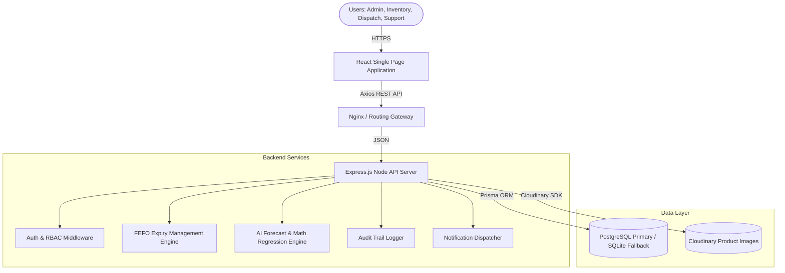
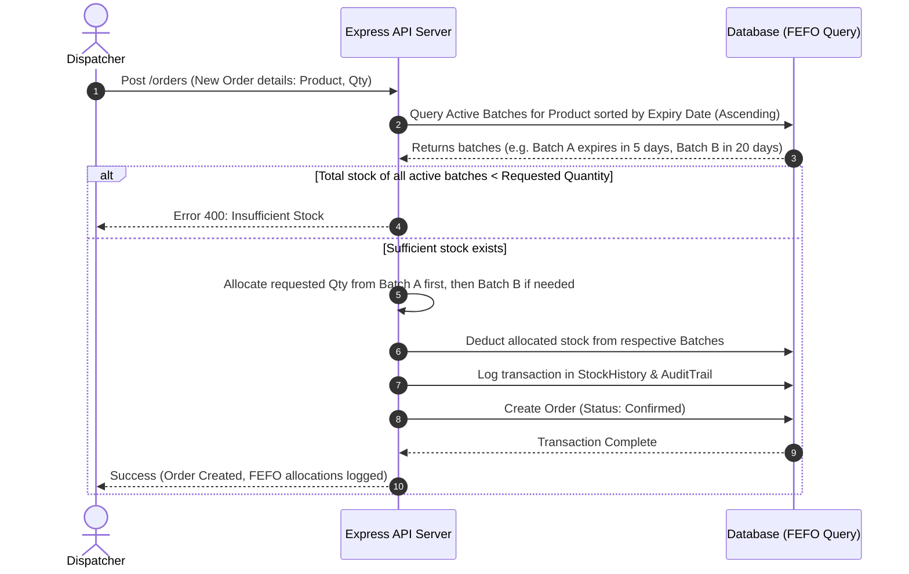

# Software Requirements Specification (SRS)

## 1. Problem Statement
Sharadha Stores manufactures and sells homemade food products in batches. Currently, their inventory, production records, expiry tracking, order management, customer follow-ups, and stock monitoring are managed manually via WhatsApp messages, phone calls, and spreadsheets. This leads to:
* **Inaccurate Stock Levels**: Inability to track available inventory in real time.
* **Wastage & Expiry**: Food products expiring before sales due to lack of batch alerts.
* **Operational Inefficiencies**: Delayed order fulfillment, manual data entries, and scattered records.
* **Revenue Loss**: Accepting orders for out-of-stock items, missing sales opportunities, and poor demand planning.
* **Lack of Accountability**: No ownership tracking, audit trail, or logs of user modifications.

---

## 2. System Objectives
* **Centralize Operations**: Consolidate products, batches, orders, and customer databases into a single, cloud-ready SaaS-style web application.
* **Automate Inventory Lifecycle**: Track batch production from manufacturing to dispatch, auto-deducting stock using the First-Expired-First-Out (FEFO) inventory model.
* **Mitigate Wastage**: Real-time monitoring of shelf lives with proactive 30-day, 15-day, and 7-day alerts.
* **Enhance Customer Service**: Centralize customer ordering history and follow-up flags.
* **Provide Insights**: Build AI-driven analytics for demand forecasting, stock replenishment, and expiry risk profiling.
* **Ensure Security & Auditability**: Implement JWT authentication with role-based access control (RBAC) and record all system modifications in an immutable audit trail.

---

## 3. System Architecture Diagram



---

## 4. Use Case Diagram

```mermaid
leftToRightDirection
actor "Admin/Super Admin" as admin
actor "Inventory Manager" as inv_mgr
actor "Production Manager" as prod_mgr
actor "Dispatch Team" as dispatch
actor "Customer Support" as support

rectangle "Sharadha Stores Platform" {
  usecase "Authenticate (Login/Register)" as UC1
  usecase "Manage Products & Categories" as UC2
  usecase "Record Batch Production" as UC3
  usecase "Track Expiration & FEFO Stock" as UC4
  usecase "Manage Orders (Create/Dispatch)" as UC5
  usecase "Manage Customer CRM Profiles" as UC6
  usecase "Query Audit Logs & History" as UC7
  usecase "Generate Reports & AI Insights" as UC8
}

admin --> UC1
admin --> UC2
admin --> UC3
admin --> UC4
admin --> UC5
admin --> UC6
admin --> UC7
admin --> UC8

inv_mgr --> UC1
inv_mgr --> UC2
inv_mgr --> UC4
inv_mgr --> UC7

prod_mgr --> UC1
prod_mgr --> UC3
prod_mgr --> UC4

dispatch --> UC1
dispatch --> UC5

support --> UC1
support --> UC5
support --> UC6
```

---

## 5. User Flow Diagram (Order Fulfillment & FEFO Allocation)



---

## 6. Functional Requirements

### Module 1: Authentication & Authorization
* **Secure Login**: Password encryption using bcrypt. JWT token generation.
* **Role-Based Access Control (RBAC)**: Enforce access scopes for Super Admin, Admin, Inventory Manager, Production Manager, Dispatch Team, Customer Support.

### Module 2: Product Management
* CRUD operations for products.
* Fields: Title, description, SKU, category, price, shelf-life (days), and image url.

### Module 3: Batch Inventory Management
* Record new production batches with a designated Manufacturing Date.
* Auto-calculate Expiry Date based on product shelf life.
* Fields: Batch ID (SKU-YYYYMMDD-seq), Mfg Date, Expiry Date, Quantity Produced, Current Stock, Status (Active, Expired, Recalled, Exhausted).

### Module 4: Inventory Monitoring
* Real-time aggregate inventory counts by product.
* Log Stock In (production) and Stock Out (sales, wastage, adjustment) histories.

### Module 5: Expiry Management System
* Automatic warning flags for batches near expiry (30, 15, 7 days).
* Automatic status transition to "Expired" when current date surpasses Expiry Date.
* Expiry dashboard panels to prioritize selling near-expiry stock (FEFO logic).

### Module 6: Order Management System
* Order lifecycle transition (Pending -> Confirmed -> Processing -> Packed -> Dispatched -> Delivered -> Cancelled).
* Auto-deduction of stocks upon order confirmation.

### Module 7: Customer Management
* CRM interface tracking customer name, phone, email, and order histories.
* Purchase patterns (average purchase value, purchase frequency).

### Module 8: Smart Notification Engine
* Simulated alerts (email/SMS/WhatsApp logs) for:
  * Low stock (below threshold).
  * Expiration (near expiry warnings).
  * Order status changes.

### Module 9: Audit Trail & Activity Logs
* Capture all write/update events in the database.
* Store: User ID, action string, target entity, timestamp, old state, and new state.

### Module 10: Reporting & Analytics
* Generate Stock Movement, Sales Revenue, and Expired/Wastage financial loss reports.
* Support data export to CSV and JSON formats.

### Module 11: AI Intelligence Layer
* **Demand Forecasting**: 3-month moving average and linear trend predictions.
* **Replenishment Recommendations**: Alerts suggesting new batch production when current stock falls below projected demand.
* **Expiry Risk Prediction**: Identify batches likely to go to waste if sales patterns persist.

---

## 7. Non-Functional Requirements
* **Performance**: API response times under 200ms for read operations. Dashboard loading under 1.5s.
* **Security**: JWT-based authentication stored securely in client state, HTTPS enforcement, SQL injection protection via Prisma ORM parameters, CORS configuration.
* **Reliability & Database Failover**: Smooth fallback to SQLite if PostgreSQL connection fails.
* **Scalability**: Paginated listings for products, batches, orders, and audits to support thousands of database rows.
* **Usability**: Fully responsive interface optimized for mobile and desktop screens.
